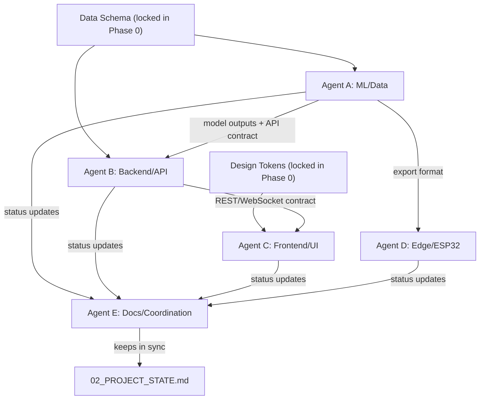

# SkyGuard AI — Agent Orchestration Map

> How to split this build across multiple AI agents/tools working **at the same time**, and
> how they stay in sync using `02_PROJECT_STATE.md` as the shared source of truth.

---

## 1. Core Rule

**`02_PROJECT_STATE.md` is the shared brain.** Every agent:
1. Reads it before starting.
2. Works only inside its owned area (§3 below).
3. Appends a changelog entry when done (never edits another agent's entry).
4. Logs any cross-cutting decision (schema change, API contract change, design-token change)
   in the Decision Log so nobody else silently drifts out of sync.

This lets you literally hand `02_PROJECT_STATE.md` (plus this file) to a *second* AI agent
running in parallel — it can pick up the next unassigned task without stepping on the first
agent's work.

---

## 2. Agent Roles

| Agent | Role | Primary Docs to Read First |
|---|---|---|
| **Agent A — ML/Data** | Builds detection models, explainability, health scoring, imputation | `01_PRD_FEATURE_SPEC.md` §4.1–4.6 |
| **Agent B — Backend/API** | Ingestion, streaming, REST/WebSocket API, alerting | `01_PRD_FEATURE_SPEC.md` §4.7–4.10 |
| **Agent C — Frontend/UI (Antigravity + Stitch)** | Generates and wires the dashboard UI | `04_ANTIGRAVITY_STITCH_PROMPT.md`, `01_PRD_FEATURE_SPEC.md` §5 |
| **Agent D — Edge/ESP32** | TinyML export, firmware stub, energy story | `01_PRD_FEATURE_SPEC.md` §4.9 |
| **Agent E — Docs/Coordination** | Keeps `02_PROJECT_STATE.md`, README, and Report accurate and in sync; resolves conflicts | all docs |

A single human (or a single powerful agent) can also play multiple roles sequentially — the
roles exist to divide *work*, not to require *headcount*.

---

## 3. Dependency Graph



**Key insight:** Agent C (Frontend) does NOT need to wait for Agent B (Backend) to finish — it
should build against a **mocked API response** matching the agreed contract from Day 1, then
swap the mock for the real endpoint once Agent B ships it. This is what lets frontend and
backend truly run in parallel.

---

## 4. Suggested Parallel Work Split (matches `03_IMPLEMENTATION_PLAN.md`)

| Timeframe | Agent A (ML) | Agent B (Backend) | Agent C (Frontend) | Agent D (Edge) | Agent E (Docs) |
|---|---|---|---|---|---|
| Day 1 | Schema + synthetic data | API skeleton + mock contract | Design tokens + static screens | (idle/reading) | Freeze Phase 0 docs |
| Day 2–3 | Statistical + ML detection layers | Streaming ingestion + alert stub | Wire UI to mock data | Research TFLite-Micro export | Track task board |
| Day 4 | Fusion + explainability | Real API live, WebSocket | Swap mock → live API | Draft quantized model | Update decision log |
| Day 5 | Sensor health + imputation | Alert channels finished | Demo/Judge Mode UI | Export + firmware stub | Draft Report §5–8 |
| Day 6 | Model tuning/eval | Integration bugfixes | Polish/responsiveness | Finalize writeup | Finalize README |
| Day 7 | — | — | Demo rehearsal (all) | — | Submission package |

---

## 5. Conflict-Avoidance Protocol

- **File ownership:** see `02_PROJECT_STATE.md` §3 (Module Ownership Map). An agent should not
  write inside another agent's folder without logging why in the Decision Log.
- **API contract changes:** whoever changes a REST/WebSocket shape must log it in the Decision
  Log *and* ping (leave a note for) any agent whose module consumes it.
- **Design token changes:** any color/type/motion change must be made in
  `04_ANTIGRAVITY_STITCH_PROMPT.md`'s Design Tokens Reference table *first*, then propagated —
  never patched ad hoc inside a single screen.
- **Merge conflicts on `02_PROJECT_STATE.md` itself:** since it's append-only for the
  changelog, conflicts should be rare; if two agents edit the Task Board table simultaneously,
  the later agent reconciles by hand and notes it in their changelog entry.

---

## 6. Handoff Template (use when passing work to another agent/session)

```
HANDOFF — from: <agent> — to: <agent/next session>
Completed: <task IDs from Task Board>
State of the world: <1-3 sentences>
Next recommended task(s): <task ID(s)>
Anything blocking: <yes/no + detail>
Read before starting: <doc(s)>
```

Paste this into the next agent's opening prompt along with the current
`02_PROJECT_STATE.md` contents for a clean continuation.
