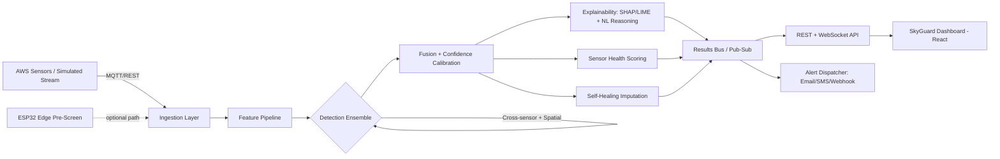

# SkyGuard AI
### Intelligent Real-Time Anomaly Detection for Automatic Weather Stations

> Built for **Smart India Hackathon** — Problem Statement **SIH26073**
> Ministry of Earth Sciences (MoES) · India Meteorological Department
> Theme: **Disaster Management** · Category: **Software**

---

## 🌩️ What is SkyGuard AI?

Automatic Weather Stations (AWS) feed the forecasts that keep planes flying, farms planting,
and disaster teams warned. But sensors drift, freeze, glitch, and lose power — and traditional
threshold checks can't tell a broken sensor from a genuine storm.

**SkyGuard AI** is a real-time anomaly-detection layer that:

- 🔍 **Detects** spikes, frozen values, drift, comms dropouts, and cross-sensor inconsistencies
  across temperature, pressure and humidity.
- 🧠 **Learns** each station's normal seasonal/temporal rhythm.
- 🧩 **Explains itself** — every alert ships with a confidence score and a plain-language reason
  (powered by SHAP/LIME).
- 🩺 **Predicts sensor health** and flags stations that need maintenance before they fail.
- 🛠️ **Self-heals** — optionally proposes a corrected value, clearly marked as an estimate.
- ⚡ **Scales down** to the edge — designed with an ESP32/TinyML deployment path in mind.

---

## 🏆 Grand Challenge

> *"Can AI build a self-aware and self-healing weather observation network capable of
> delivering trustworthy atmospheric data under all environmental conditions?"*

SkyGuard AI's answer: **Self-Aware** (confidence + health scoring) + **Self-Explaining**
(SHAP/LIME reasoning) + **Self-Healing** (imputation + predictive maintenance).

---

## ✨ Key Features

| | |
|---|---|
| Real-time multivariate anomaly detection | Ensemble: statistical + Isolation Forest + LSTM-Autoencoder |
| Cross-sensor consistency checks | Physical-plausibility + learned correlation rules |
| Spatial neighbor comparison | Separates local sensor fault from real regional weather |
| Explainable AI | SHAP/LIME + natural-language reasoning generator |
| Confidence & severity scoring | Calibrated 0–100% confidence, Low→Critical severity |
| Root-cause classification | Sensor fault / drift / comms failure / power issue / real event |
| Sensor health & predictive maintenance | Degradation trend forecasting per station |
| Self-healing imputation | Corrected-value suggestions with full audit trail |
| Live dashboard | Station map, time-series, alert feed, explainability drill-down |
| Demo / Judge mode | One-click synthetic anomaly injection to showcase detection live |
| Edge-AI ready | Quantized model path for ESP32 / TinyML deployment |

Full exhaustive feature list: see [`01_PRD_FEATURE_SPEC.md`](./01_PRD_FEATURE_SPEC.md).

---

## 🏗️ Architecture (high level)



---

## 🧰 Tech Stack

- **ML/Data:** Python, pandas, scikit-learn, PyTorch/TensorFlow, SHAP, LIME, statsmodels
- **Backend:** FastAPI (or Node/Express), Redis, PostgreSQL/TimescaleDB, MQTT
- **Frontend:** React, built with **Google Antigravity + Stitch** (see UI prompt doc), Recharts/D3, Leaflet/Mapbox
- **Edge:** TensorFlow Lite for Microcontrollers, ESP32
- **Infra:** Docker Compose (local demo), GitHub Actions (optional CI)

---

## 📂 Repository Structure (proposed)

```
skyguard-ai/
├── data/                # datasets, synthetic anomaly generator
├── ml/                  # detection models, training, evaluation
├── backend/             # API, streaming, alerting
├── frontend/            # React app (Antigravity/Stitch output lives here)
├── edge/                # ESP32 / TinyML export
├── docs/                # this doc pack
│   ├── 01_PRD_FEATURE_SPEC.md
│   ├── 02_PROJECT_STATE.md
│   ├── 03_IMPLEMENTATION_PLAN.md
│   ├── 04_ANTIGRAVITY_STITCH_PROMPT.md
│   ├── 05_PROJECT_REPORT.md
│   └── 06_AGENT_ORCHESTRATION_MAP.md
└── README.md
```

---

## 🚀 Getting Started (fill in once code exists)

```bash
# 1. Clone
git clone <repo-url> && cd skyguard-ai

# 2. Backend
cd backend && pip install -r requirements.txt && uvicorn main:app --reload

# 3. Frontend
cd frontend && npm install && npm run dev

# 4. Simulate a data stream
python data/simulate_stream.py --stations 20 --inject-anomalies
```

---

## 📊 Evaluation Alignment (SIH grading rubric)

| Criteria | Weight | Where it's demonstrated |
|---|---|---|
| Innovation & Novelty | 25% | Spatial+cross-sensor fusion, self-healing loop |
| Detection Accuracy | 20% | Ensemble model, tested vs. injected anomalies |
| Real-Time Capability | 15% | Streaming pipeline, live dashboard |
| Explainability | 10% | SHAP/LIME panel |
| Scalability | 10% | Stateless workers, multi-station design |
| Practical Deployability | 10% | Dockerized, ESP32 path |
| Visualization/UI | 5% | SkyGuard dashboard |
| Energy Efficiency | 5% | Quantized edge model |

---

## 🗺️ Related Docs

- [Feature Spec / PRD](./01_PRD_FEATURE_SPEC.md)
- [Living Project State](./02_PROJECT_STATE.md) — **source of truth for multi-agent work**
- [Implementation Plan](./03_IMPLEMENTATION_PLAN.md)
- [Antigravity/Stitch UI Prompt](./04_ANTIGRAVITY_STITCH_PROMPT.md)
- [Project Report](./05_PROJECT_REPORT.md)
- [Agent Orchestration Map](./06_AGENT_ORCHESTRATION_MAP.md)

---

## 👥 Team

_(fill in team name & members)_

## 📄 License

_(choose a license, e.g., MIT — fine for a hackathon submission)_
